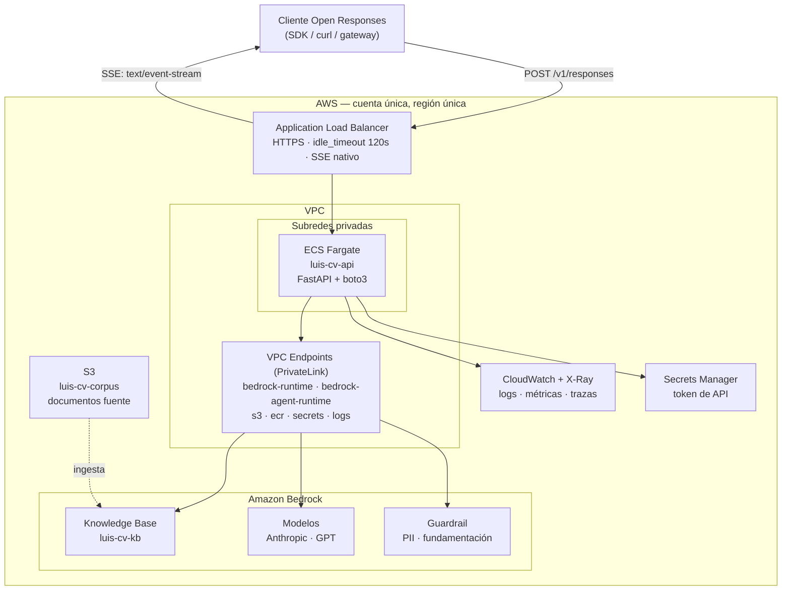

# luis-cv

Agente conversacional con RAG sobre documentación profesional verificada,
expuesto como un endpoint compatible con **Open Responses** y desplegado en AWS
con arquitectura de grado bancario.

---

## Qué es

`luis-cv` responde preguntas sobre una trayectoria profesional —formación,
titulación, certificaciones, experiencia— fundamentando **cada afirmación en el
documento oficial que la respalda**. No es un chatbot sobre un currículum: es
un agente cuya salida es auditable, porque devuelve junto a la respuesta la
evidencia documental que la sustenta.

El problema que resuelve no es "responder bien". Es **responder de forma
verificable**. En un dominio donde una alucinación equivale a afirmar una
credencial falsa, un agente que suena convincente pero no puede probar lo que
dice no sirve. Por eso la recuperación no es un paso interno oculto: se emite
como un ítem de salida del protocolo, con la consulta ejecutada, los fragmentos
recuperados y su procedencia.

Está construido como implementación conforme del spec **Open Responses
2026-04-24**, de modo que cualquier cliente que hable ese protocolo —SDKs,
gateways, Open WebUI— puede consumirlo sin adaptadores.

---

## Arquitectura



### Flujo de una petición

1. El ALB termina TLS y enruta al servicio en subredes privadas. Su
   `idle_timeout` está elevado para no cortar respuestas largas.
2. La aplicación valida la petición contra el contrato y resuelve el alias de
   modelo a un ID de Bedrock.
3. **Recuperación:** `bedrock-agent-runtime:Retrieve` sobre la Knowledge Base.
   Los fragmentos se emiten como el ítem `agente:knowledge_search`.
4. **Inferencia:** `bedrock-runtime:ConverseStream` con el contexto recuperado,
   filtrado por el guardrail.
5. Los tokens se traducen a eventos semánticos de Open Responses y viajan como
   SSE hasta el cliente, sin buffering intermedio.

**Todo el tráfico hacia Bedrock, S3 y ECR viaja por PrivateLink.** Nunca sale a
internet público. Es la razón técnica —no solo declarativa— por la que se
descartó un router de modelos externo.

### Componentes

| Capa | Servicio | Recurso | Por qué |
|---|---|---|---|
| Borde | ALB | `luis-cv-prod-alb` | Timeouts controlables y SSE nativo. API Gateway impone un límite duro de 29 s que un RAG puede superar |
| Cómputo | ECS Fargate | `luis-cv-api` | Control total del ciclo de vida de la conexión, sin servidores que administrar |
| Inferencia | Bedrock | Anthropic · GPT | Soberanía de datos: IAM nativo, sin llaves externas ni salida a internet |
| Recuperación | Bedrock KB | `luis-cv-kb` | RAG administrado sin capa de orquestación de terceros |
| Seguridad | Guardrails | `luis-cv-guardrail` | Filtro de PII y verificación de fundamentación |
| Almacenamiento | S3 | `luis-cv-corpus-<acct>` | Origen de la ingesta, cifrado y sin acceso público |
| Secretos | Secrets Manager | `luis-cv/api-token` | Ninguna credencial en imagen ni en variables de entorno |
| Observabilidad | CloudWatch · X-Ray | `luis-cv-prod` | Trazado por tramos: recuperación e inferencia por separado |

### Stack

`Python` · `FastAPI` · `boto3` · `Docker` · `Terraform`

El código sigue **arquitectura hexagonal**: el núcleo —reglas de veracidad,
enmascarado de identificadores, traducción a eventos— no importa `fastapi` ni
`boto3`; la recuperación y la inferencia entran por puertos. Detalle en
`docs/arquitectura.md`.

Sin LangChain ni LlamaIndex: menos dependencias, menos superficie de ataque,
código auditable y control directo del prompt y del formato de eventos.

---

## Uso

Todas las peticiones van a `POST /v1/responses` con
`Authorization: Bearer <token>` y `Content-Type: application/json`.

### Consulta simple

```bash
curl -X POST "$BASE_URL/v1/responses" \
  -H "Authorization: Bearer $API_TOKEN" \
  -H "Content-Type: application/json" \
  -d '{
    "model": "agente-rag-sonnet",
    "input": "¿Qué formación académica tiene y está titulado?"
  }'
```

Respuesta (abreviada). Nótese el **recibo de recuperación** antes del mensaje:

```jsonc
{
  "id": "resp_01H8X...",
  "status": "completed",
  "model": "agente-rag-sonnet",
  "output": [
    {
      "type": "agente:knowledge_search",
      "id": "ks_8f3a1c",
      "status": "completed",
      "queries": ["formación académica", "título profesional"],
      "results": [
        {
          "document_id": "titulo-ingenieria-2019.pdf",
          "chunk": "…",
          "score": 0.91,
          "metadata": { "tipo": "documento_oficial", "anio": 2019 }
        }
      ],
      "latency_ms": 312
    },
    {
      "type": "message",
      "id": "msg_02K9…",
      "role": "assistant",
      "status": "completed",
      "content": [
        {
          "type": "output_text",
          "text": "Cuenta con título de Ingeniería, expedido en 2019 … [titulo-ingenieria-2019.pdf]"
        }
      ]
    }
  ],
  "usage": { "input_tokens": 1840, "output_tokens": 96 }
}
```

### Streaming

```bash
curl -N -X POST "$BASE_URL/v1/responses" \
  -H "Authorization: Bearer $API_TOKEN" \
  -H "Content-Type: application/json" \
  -d '{
    "model": "agente-rag-sonnet",
    "stream": true,
    "input": "Resume su experiencia en la nube."
  }'
```

Secuencia de eventos, conforme al spec:

```
event: response.created
event: response.in_progress
event: response.output_item.added      ← agente:knowledge_search
event: response.output_item.done       ← fragmentos recuperados
event: response.output_item.added      ← message
event: response.content_part.added
event: response.output_text.delta      ← repetido
event: response.output_text.done
event: response.content_part.done
event: response.output_item.done
event: response.completed
data: [DONE]
```

`sequence_number` es monotónico y sin huecos; concatenar los `delta` reproduce
exactamente el texto de `output_text.done`.

### Conversación de varios turnos

El servidor es **sin estado** y no persiste transcripciones. El historial se
envía completo en cada llamada:

```jsonc
{
  "model": "agente-rag-sonnet",
  "input": [
    { "type": "message", "role": "user",
      "content": [{ "type": "input_text", "text": "¿Tiene experiencia en AWS?" }] },
    { "type": "message", "role": "assistant",
      "content": [{ "type": "output_text", "text": "Sí, …" }] },
    { "type": "message", "role": "user",
      "content": [{ "type": "input_text", "text": "¿En qué proyectos?" }] }
  ]
}
```

El cliente es dueño de su contexto y de su retención. Si el cliente no guarda
nada, no existe nada.

### Modelos disponibles

| Alias | Uso |
|---|---|
| `agente-rag-sonnet` | Default. Mejor calidad de razonamiento |
| `agente-rag-haiku` | Menor latencia y costo |
| `agente-rag-gpt` | Contraste entre familias de modelo |

El cliente nunca envía IDs de Bedrock. El mapa de alias se resuelve en el
servidor y se valida al arranque; un alias no reconocido devuelve
`invalid_request` con `code: "model_not_found"`.

### Salud

```bash
curl "$BASE_URL/healthz"   # liveness, sin autenticación
curl "$BASE_URL/readyz"    # verifica Bedrock y KB alcanzables
```

---

## Despliegue

### Requisitos

- AWS CLI con el perfil `luis` configurado
- Terraform ≥ 1.6, Docker, Python ≥ 3.11
- Acceso concedido en Bedrock a los modelos del mapa de alias

### Pasos

```bash
# 1. Verificar identidad y cuenta destino
aws sts get-caller-identity --profile luis

# 2. Configurar
cp infra/terraform.tfvars.example infra/terraform.tfvars
# editar: aws_account_id, aws_region, domain_name

# 3. Infraestructura
cd infra && terraform init && terraform apply

# 4. Corpus e ingesta
./scripts/sync-kb.sh

# 5. Construir y desplegar la aplicación
./scripts/deploy.sh

# 6. Verificar
./scripts/smoke.sh
```

`deploy.sh` compara el account ID real contra el configurado y **aborta si no
coinciden**. El provider de Terraform aplica la misma guarda vía
`allowed_account_ids`. Desplegar en la cuenta equivocada no tiene deshacer; se
previene en dos capas.

### Configuración

| Variable | Default | Descripción |
|---|---|---|
| `aws_profile` | `luis` | Perfil de la máquina que despliega |
| `aws_account_id` | — | Requerido. Guarda de cuenta destino |
| `aws_region` | — | Región de despliegue |
| `project` | `luis-cv` | Prefijo y tag de todos los recursos |
| `environment` | `prod` | Sufijo de nombres |

Sobrescribible sin tocar el código:

```bash
terraform apply -var aws_profile=otro -var environment=dev
```

Todo recurso lleva los tags `Project`, `Environment`, `ManagedBy` y `Owner`, lo
que permite aislar el costo del proyecto en Cost Explorer con un filtro.

---

## Estado

| Pieza | Estado |
|---|---|
| Contrato Open Responses (casos A y B) | ✅ verificado en local |
| Recuperación, veracidad y operación (casos C y D) | ✅ verificados con corpus de prueba |
| Adaptadores de Bedrock (`Retrieve`, `ConverseStream`) | ✅ escritos y probados con clientes falsos |
| **Ingesta del corpus a la Knowledge Base** | ⏳ **pendiente** |
| Infraestructura (Terraform) y despliegue | ⏳ pendiente |

Mientras la ingesta no exista, el servicio corre con recuperación sobre
`corpus/` y un modelo local determinista. La propiedad que lo hace seguro está
probada: **sin evidencia, el agente declina; nunca inventa**. Activar Bedrock es
cambiar dos variables de entorno (`LUISCV_RETRIEVAL_BACKEND=bedrock`,
`LUISCV_INFERENCE_BACKEND=bedrock`), no tocar código.

```bash
make install        # entorno de desarrollo
make run            # API en http://localhost:8080, sin AWS
```

---

## Pruebas

```bash
make test           # suite completa en local: contrato + RAG + operación
make test-contract  # solo los casos A y B
make test-rag       # solo los casos C
make test-deployed  # la misma aceptación contra el ALB (BASE_URL, API_TOKEN)
make eval           # preguntas de oro, reporte comparativo entre modelos
make smoke          # verificación rápida contra el desplegado
```

La suite verifica el contrato (esquema, errores, orden y numeración de
eventos), la recuperación (cita el documento correcto) y la **veracidad**: ante
una credencial inexistente el agente debe negar, no inventar. Ese caso tiene
tolerancia cero.

Dos pruebas gobiernan la entrega:

- **Sin buffering:** los deltas deben llegar espaciados en el tiempo a través
  del ALB. Si llegan todos al final, el streaming no existe en la práctica.
- **Cero credenciales inventadas:** una sola invalida el despliegue.

---

## Seguridad y privacidad

El corpus contiene documentos de identidad y credenciales profesionales. El
diseño lo trata en consecuencia:

- **Retención cero.** `store: true` se rechaza explícitamente. No se persisten
  entradas ni salidas.
- **Logs sin PII.** Solo identificadores, contadores y latencias. Nunca el
  texto del turno.
- **Enmascarado en la salida.** El agente confirma la existencia y vigencia de
  una credencial; los identificadores completos (cédula, CURP, RFC) van
  enmascarados salvo petición explícita y autenticada.
- **Sin salida a internet.** PrivateLink para todo servicio de AWS consumido.
- **Permisos mínimos.** El rol de tarea concede solo `InvokeModelWithResponseStream`,
  `Retrieve` sobre el ARN específico de la KB y `ApplyGuardrail`. Sin comodines.
- **Errores opacos.** Ningún ARN, ID de cuenta ni traza de excepción llega al
  cliente; se devuelve un `request_id` para correlación.
- El directorio `corpus/` está excluido de control de versiones.

---

## Limitaciones conocidas

Declaradas de forma deliberada, no omitidas:

| No implementado | Razón |
|---|---|
| Transporte WebSocket | Opcional en el spec; no aporta al caso de uso |
| `previous_response_id` | Exigiría persistir transcripciones, en conflicto con la retención cero |
| `GET /v1/responses/{id}` | Consecuencia de no almacenar respuestas |
| Herramientas de función externas | Agente de dominio cerrado; no cede control al cliente |
| Entrada multimodal | El corpus es texto; se rechaza con error explícito |

Un endpoint que finge soportar todo y falla en silencio es peor que uno con una
superficie honesta y documentada.

---

## Costos

El componente dominante no es la inferencia, sino el **vector store de la
Knowledge Base**, que puede facturar de forma continua exista o no tráfico.
Revisar `docs/arquitectura.md` para la comparación de alternativas.

Para desmontar todo:

```bash
cd infra && terraform destroy
```

---

## Documentación

| Documento | Contenido |
|---|---|
| `docs/contrato-open-responses.md` | Contrato normativo del endpoint y suite de aceptación |
| `docs/arquitectura.md` | Diagrama detallado y justificación de cada componente |
| `BITACORA.md` | Proceso de decisión: hipótesis evaluadas y rutas descartadas |

La bitácora documenta también lo que **no** se eligió y por qué: OpenRouter
frente a Bedrock, Lambda y API Gateway frente a Fargate, y frameworks de
orquestación frente al SDK nativo.