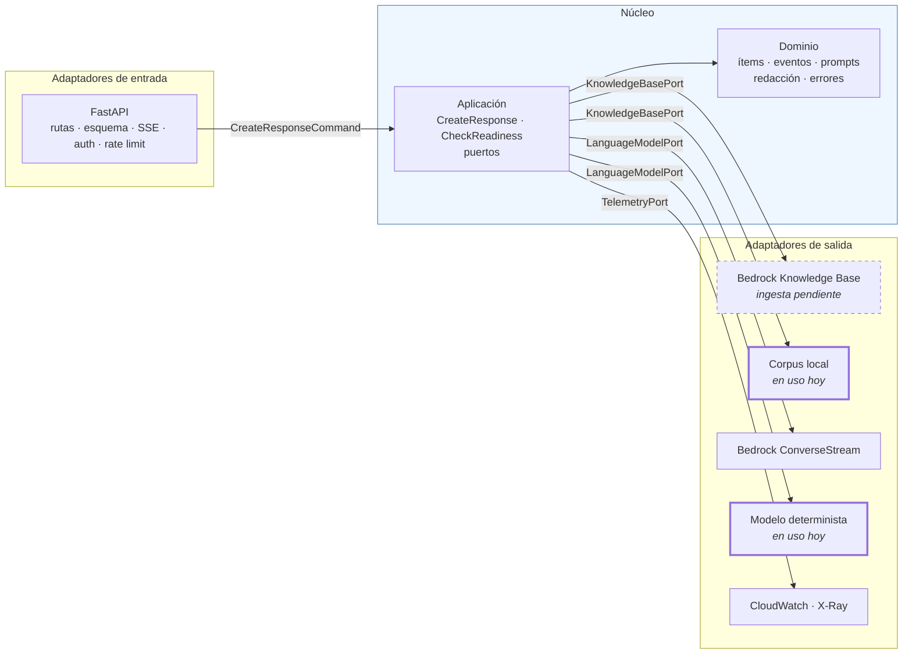
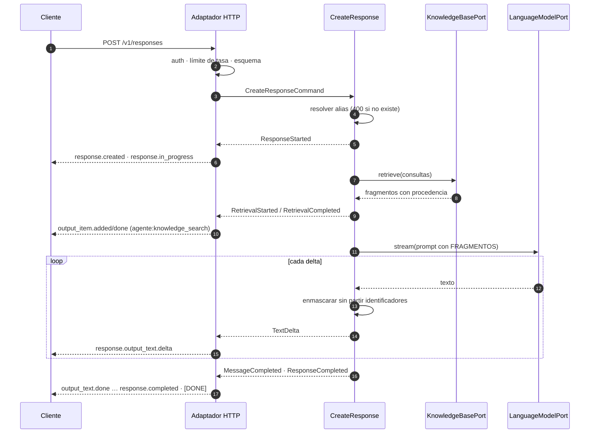

# Arquitectura — `luis-cv`

> Documento vivo. Describe **cómo está construido el código** y por qué esa
> forma. La justificación de los servicios de AWS vive en `BITACORA.md`; el
> comportamiento observable, en `contrato-open-responses.md`.

---

## 1. La forma: hexagonal (puertos y adaptadores)

El agente tiene una regla de negocio que no puede depender de nada externo:
**no afirmar nada que no esté en la evidencia recuperada**. Esa regla, el
enmascarado de identificadores y la traducción a eventos son el valor del
proyecto; Bedrock, FastAPI y S3 son detalles reemplazables.

Por eso las dependencias apuntan hacia adentro. El núcleo declara *puertos* —lo
que necesita del mundo— y la infraestructura provee *adaptadores* que los
cumplen. El núcleo nunca importa `fastapi`, `boto3` ni `pydantic`; hay una
prueba que lo verifica leyendo los imports de cada módulo
(`tests/unit/test_arquitectura.py`).



### Puertos y adaptadores

| Puerto | Qué necesita el núcleo | Adaptador en producción | Adaptador hoy | Doble en pruebas |
|---|---|---|---|---|
| `KnowledgeBasePort` | Evidencia con procedencia | `BedrockKnowledgeBase` | `LocalCorpusKnowledgeBase` | `StubKnowledgeBase` |
| `LanguageModelPort` | Deltas de texto y consumo | `BedrockLanguageModel` | `GroundedStubLanguageModel` | `ScriptedLanguageModel` |
| `ModelCatalogPort` | Alias → modelo del proveedor | `BedrockModelCatalog` | `StaticModelCatalog` | `StaticModelCatalog` |
| `TelemetryPort` | Eventos, avisos y tramos | `StructuredTelemetry` | `StructuredTelemetry` | `RecordingTelemetry` |
| `ClockPort` / `IdGeneratorPort` | Tiempo e identificadores | `SystemClock` / `UuidGenerator` | igual | `FrozenClock` / `SequentialIds` |

El único módulo que conoce a todos es `infrastructure/container.py`. Cambiar de
recuperación local a Bedrock Knowledge Base —el pendiente de la ingesta— es
cambiar una variable de entorno: `LUISCV_RETRIEVAL_BACKEND=bedrock`.

### Qué compró esta forma, en concreto

- **La suite corre sin AWS.** 146 casos —contrato, recuperación, veracidad,
  operación— en unos dos segundos, sin credenciales ni red. La misma suite
  vuelve a correr contra el ALB con `make test-deployed`.
- **El endpoint existe antes que la infraestructura.** El contrato se verifica
  hoy, con la ingesta del corpus todavía pendiente.
- **Los adaptadores de Bedrock ya están probados** con clientes falsos
  (`tests/unit/test_adaptadores_bedrock.py`): traducción de `ConverseStream`,
  fusión de resultados de `Retrieve`, `throttling` → `too_many_requests` y la
  garantía de que ningún ARN llega al cliente.

El costo es real: más archivos y una indirección extra. En un CRUD sería
sobreingeniería. Aquí la frontera coincide con lo que de verdad cambia —el
proveedor de inferencia y el de recuperación— y con lo que hay que poder probar
sin nube.

---

## 2. Estructura del repositorio

```
src/luis_cv/
├── domain/                     # reglas puras, sin dependencias externas
│   ├── conversation.py         # turnos normalizados, ajustes de generación
│   ├── retrieval.py            # Chunk, RetrievalOutcome (evidencia)
│   ├── items.py                # ítems de salida y respuesta final
│   ├── events.py               # eventos semánticos del stream
│   ├── prompts.py              # reglas duras de veracidad y citación
│   ├── redaction.py            # enmascarado, también en streaming
│   ├── query_planning.py       # plan de consultas para recuperar
│   └── errors.py               # tipos de error del contrato §5
├── application/                # casos de uso y puertos
│   ├── ports.py                # KnowledgeBase, LanguageModel, Catalog, …
│   ├── commands.py             # CreateResponseCommand
│   ├── create_response.py      # orquestación: recuperar → fundamentar → emitir
│   └── check_readiness.py      # /readyz
├── infrastructure/
│   ├── config.py               # entorno; alias e IDs nunca en el código
│   ├── container.py            # composición de dependencias
│   ├── inbound/http/           # FastAPI, esquema, SSE, auth, límite de tasa
│   └── outbound/
│       ├── bedrock/            # KnowledgeBase (Retrieve) y ConverseStream
│       ├── local/              # corpus local y modelo determinista
│       └── telemetry/          # logs JSON con tramos
└── main.py                     # uvicorn luis_cv.main:app

tests/
├── contract/    # casos A (HTTP y esquema) y B (SSE)
├── rag/         # casos C (recuperación y veracidad)
├── operation/   # casos D (salud, logs, concurrencia, límite de tasa)
├── unit/        # dominio, aplicación, adaptadores y guardas de arquitectura
├── deployed/    # la misma aceptación contra el ALB (BASE_URL)
├── fixtures/    # corpus de prueba: datos inventados, sin PII real
└── golden.yaml  # preguntas de oro (pendiente: decisión C)
```

---

## 3. El camino de una petición



Tres decisiones de este camino merecen nombre:

**El primer evento se consume antes de responder.** En streaming, el adaptador
pide el primer evento al núcleo *antes* de devolver la respuesta. Así un alias
inexistente sigue siendo un `400` con cabeceras y no un error a medio stream
que el cliente no puede distinguir de una respuesta corta.

**El enmascarado retiene una cola.** Un CURP puede partirse entre dos deltas.
`StreamingRedactor` no emite hasta el siguiente límite de palabra, de modo que
ningún identificador se evalúa a medias. Una prueba parametrizada verifica que
trocear el mismo texto en piezas de 1, 2, 3, 5, 8 y 13 caracteres produce
exactamente el mismo resultado que enmascararlo entero.

**El modo no streaming es la misma ejecución, agregada.** `execute()` consume
los mismos eventos de dominio que `stream()`. Si fueran dos caminos distintos,
las pruebas de contrato dejarían de decir algo sobre el otro.

---

## 4. Estado actual y lo que falta

| Etapa (plan) | Estado |
|---|---|
| E1 — Endpoint local, contrato completo | ✅ casos A1–A10 y B1–B10 en verde |
| E2 — Preparación del corpus | ✅ 10 documentos normalizados, con metadatos y manifiesto |
| E3 — Knowledge Base e ingesta | ◐ KB sobre S3 Vectors escrita en Terraform y validada; falta `apply` e ingesta |
| E4 — Prompt, veracidad y redacción | ✅ reglas, enmascarado y casos C contra el modelo real; guardrail administrado pendiente |
| E5 — Contenedor y despliegue | ◐ Terraform completo y validado (54 recursos, `plan` limpio); falta el primer `apply` |
| E6 — Observabilidad | ◐ logs JSON, métricas por filtro, panel y dos alarmas en Terraform; falta X-Ray |
| E7 — Evaluación | ◐ 13 preguntas de oro medidas contra los tres alias; faltan las 20 y repetir con la KB |

**Inferencia real conectada.** El servicio ya corre contra Bedrock sin
infraestructura: `LUISCV_INFERENCE_BACKEND=bedrock` con la recuperación local.
`make test-real` ejecuta los casos C contra Claude Sonnet 5. Los resultados
comparativos entre familias están en la bitácora §9.

Mientras la ingesta no exista, el agente **no inventa: se queda sin evidencia y
declina**. Es una propiedad probada (`test_con_el_corpus_vacio_el_agente_se_queda_sin_evidencia`),
no una expectativa: es lo que hace seguro tener el sistema en pie antes de que
el corpus esté cargado.
