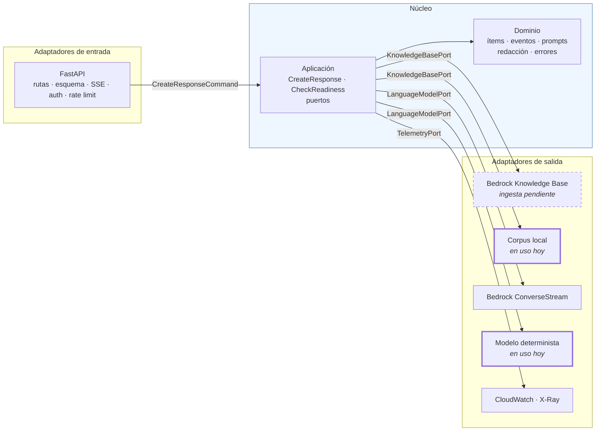
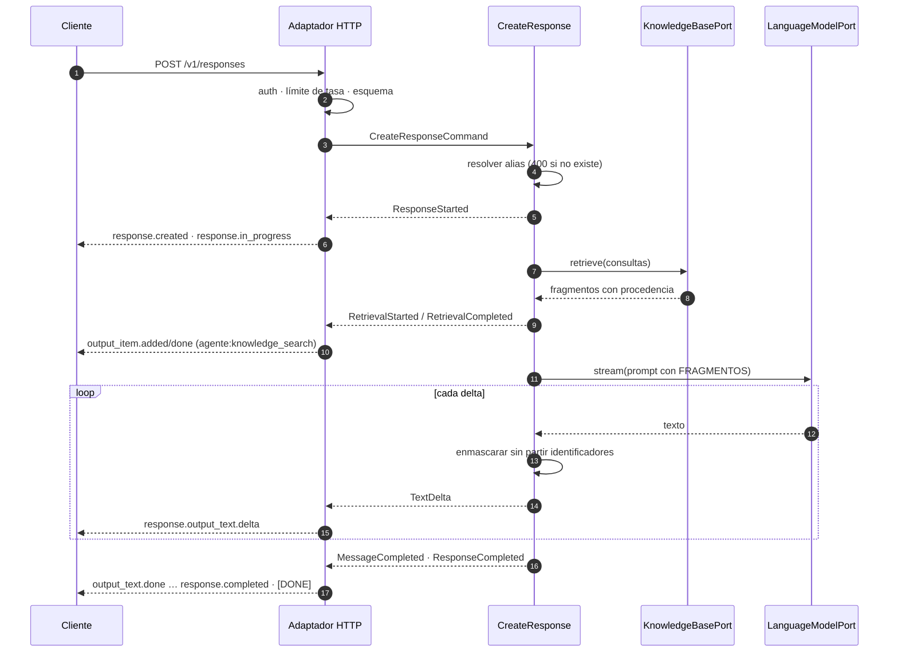

# Arquitectura — `rag-agent`

> Documento vivo. Describe **cómo está construido el código** y por qué esa
> forma. La justificación de los servicios de AWS vive en `BITACORA.md`; el
> comportamiento observable, en `contrato-open-responses.md`.

---

## 1. La forma: hexagonal (puertos y adaptadores)

El agente tiene una regla de negocio que no puede depender de nada externo:
**no afirmar nada que no esté en la evidencia recuperada**. Esa regla, el
enmascarado de identificadores y la traducción a eventos son el valor del
proyecto; Bedrock, FastAPI y S3 son detalles reemplazables.

Por eso las dependencias apuntan hacia adentro. El núcleo declara *puertos* —lo
que necesita del mundo— y la infraestructura provee *adaptadores* que los
cumplen. El núcleo nunca importa `fastapi`, `boto3` ni `pydantic`; hay una
prueba que lo verifica leyendo los imports de cada módulo
(`tests/unit/test_arquitectura.py`).



### Puertos y adaptadores

| Puerto | Qué necesita el núcleo | Adaptador en producción | Adaptador hoy | Doble en pruebas |
|---|---|---|---|---|
| `KnowledgeBasePort` | Evidencia con procedencia | `BedrockKnowledgeBase` | `LocalCorpusKnowledgeBase` | `StubKnowledgeBase` |
| `KnowledgeBaseRegistryPort` | Qué índice sirve a cada tema | `PerProfileKnowledgeBases` | igual | `SingleKnowledgeBase` |
| `ProfileRegistryPort` | Qué temas sabe responder | `StaticProfileRegistry` (YAML) | igual | `StaticProfileRegistry` |
| `LanguageModelPort` | Deltas de texto y consumo | `BedrockLanguageModel` | `GroundedStubLanguageModel` | `ScriptedLanguageModel` |
| `ModelCatalogPort` | Alias → modelo del proveedor | `BedrockModelCatalog` | `StaticModelCatalog` | `StaticModelCatalog` |
| `TelemetryPort` | Eventos, avisos y tramos | `StructuredTelemetry` | `StructuredTelemetry` | `RecordingTelemetry` |
| `ClockPort` / `IdGeneratorPort` | Tiempo e identificadores | `SystemClock` / `UuidGenerator` | igual | `FrozenClock` / `SequentialIds` |

El único módulo que conoce a todos es `infrastructure/container.py`. Cambiar de
recuperación local a Bedrock Knowledge Base es cambiar una variable de entorno:
`RAG_RETRIEVAL_BACKEND=bedrock`.

Los dos puertos de registro son lo que hace que un mismo servicio atienda varios
temas sin que el caso de uso sepa que existe más de uno: `CreateResponse` pide
«el perfil de esta petición» y «la base de ese perfil», y quien decide qué son
esas dos cosas vive fuera del núcleo.

### Qué compró esta forma, en concreto

- **La suite corre sin AWS.** 146 casos —contrato, recuperación, veracidad,
  operación— en unos dos segundos, sin credenciales ni red. La misma suite
  vuelve a correr contra el ALB con `make test-deployed`.
- **El endpoint existe antes que la infraestructura.** El contrato se verifica
  hoy, con la ingesta del corpus todavía pendiente.
- **Los adaptadores de Bedrock ya están probados** con clientes falsos
  (`tests/unit/test_adaptadores_bedrock.py`): traducción de `ConverseStream`,
  fusión de resultados de `Retrieve`, `throttling` → `too_many_requests` y la
  garantía de que ningún ARN llega al cliente.

El costo es real: más archivos y una indirección extra. En un CRUD sería
sobreingeniería. Aquí la frontera coincide con lo que de verdad cambia —el
proveedor de inferencia y el de recuperación— y con lo que hay que poder probar
sin nube.

---

## 2. Estructura del repositorio

```
src/rag_agent/
├── domain/                     # reglas puras, sin dependencias externas
│   ├── conversation.py         # turnos normalizados, ajustes de generación
│   ├── retrieval.py            # Chunk, RetrievalOutcome (evidencia)
│   ├── items.py                # ítems de salida y respuesta final
│   ├── events.py               # eventos semánticos del stream
│   ├── profile.py              # el tema: reglas, troceado y recuperación
│   ├── prompts.py              # reglas duras de veracidad y citación
│   ├── chunking.py             # qué es un fragmento citable
│   ├── redaction.py            # enmascarado por política, también en streaming
│   ├── query_planning.py       # plan de consultas para recuperar
│   └── errors.py               # tipos de error del contrato §5
├── application/                # casos de uso y puertos
│   ├── ports.py                # KnowledgeBase, LanguageModel, Catalog, …
│   ├── commands.py             # CreateResponseCommand
│   ├── create_response.py      # orquestación: recuperar → fundamentar → emitir
│   └── check_readiness.py      # /readyz
├── infrastructure/
│   ├── config.py               # entorno; alias e IDs nunca en el código
│   ├── container.py            # composición de dependencias
│   ├── profiles/               # carga de profiles/*.yaml y registro de temas
│   ├── ingest/                 # originales → fragmentos + metadatos
│   │   └── ocr/                # rescate de PDFs sin capa de texto
│   ├── inbound/
│   │   ├── http/               # FastAPI, esquema, SSE, auth, límite de tasa
│   │   └── cli/                # menú interactivo y asistente de configuración
│   └── outbound/
│       ├── bedrock/            # KnowledgeBase (Retrieve) y ConverseStream
│       ├── knowledge_bases.py  # registro: qué índice sirve a cada tema
│       ├── local/              # corpus local y modelo determinista
│       └── telemetry/          # logs JSON con tramos
└── main.py                     # uvicorn rag_agent.main:app

profiles/                       # un YAML por tema; versionado, viaja en la imagen
├── luis-cv.yaml                # credenciales: enmascarado y postura
└── coches.yaml                 # fichas técnicas: troceado y metadatos por marca

tests/
├── contract/    # casos A (HTTP y esquema) y B (SSE)
├── rag/         # casos C (recuperación y veracidad)
├── operation/   # casos D (salud, logs, concurrencia, límite de tasa)
├── unit/        # dominio, aplicación, adaptadores y guardas de arquitectura
├── deployed/    # la misma aceptación contra el ALB (BASE_URL)
├── fixtures/    # corpus de prueba: datos inventados, sin PII real
└── golden*.yaml # preguntas de oro, una por tema
```

---

## 2.b. Temas: un servicio, varios RAG

El agente no está atado a un corpus. Un **tema** (perfil) es un archivo YAML que
declara sobre qué responde, con qué reglas, cuánta evidencia recupera, qué
enmascara y cómo se trocea su corpus. Cambiar de dominio —de credenciales
profesionales a fichas técnicas de coches— es escribir ese archivo, no tocar
Python.

```
profiles/coches.yaml ──┬──> domain.Profile      reglas del prompt, troceado, redacción
                       └──> ProfileBinding      dónde vive su corpus y su KB
```

La separación no es ceremonia. Las **reglas** viajan en la imagen (son código, se
revisan en un diff, se prueban); el **enlace** —el ID de la Knowledge Base— llega
por variable de entorno desde Terraform, porque cambia entre despliegues. El
mismo `coches.yaml` sirve sin editarse en local, en las pruebas y en producción.

### Topología: un plano de cómputo, N bases de conocimiento

```
                    ┌──────────────────────────────┐
  X-Rag-Profile ──> │  ALB → ECS (un solo servicio)│
                    └───────────────┬──────────────┘
                                    │  perfil por petición
                    ┌───────────────┼───────────────┐
                    ▼               ▼               ▼
                 KB coches    KB inversiones     KB luis-cv
                 (S3 Vectors) (S3 Vectors)      (S3 Vectors)
```

Lo caro del despliegue es fijo y no depende del número de temas: VPC, ALB,
servicio de ECS y seis endpoints de interfaz. Lo que se duplica por tema es el
índice vectorial sobre S3 Vectors, que no tiene piso de costo. Duplicar el stack
entero por tema multiplicaría ~60 USD/mes por nada: el mismo contenedor sabe
responder de todos.

La alternativa —una sola KB con todos los corpus y filtro por metadatos— se
descartó: los documentos de dominios distintos competirían en el mismo ranking y
un filtro mal puesto devolvería fichas de coches a una pregunta sobre títulos.
Índices separados hacen ese error imposible en vez de improbable.

El tema se elige por petición con la cabecera `X-Rag-Profile`. Va en cabecera y
no en el cuerpo porque el cuerpo es el de Open Responses, que rechaza campos
desconocidos: un cliente estándar sigue funcionando y recibe el tema por defecto.

### La ingesta y los PDFs que no se dejan leer

Un corpus real trae documentos ilegibles, y descartarlos en silencio deja
preguntas que el agente declinará para siempre sin que nadie sepa por qué. La
ingesta intenta tres cosas en orden de coste: leer la capa de texto, descifrar
el PDF si viene con contraseña de propietario vacía, y transcribirlo.

El protocolo `MotorOcr` vive en `ingest/ocr/` y **no** en `application/ports.py`:
el servicio nunca hace OCR. Meter en los puertos del núcleo algo que el núcleo
no usa sería ensuciar la frontera que el resto del proyecto defiende.

Dos motores, y la diferencia importa más de lo que parece. `tablas` conserva la
rejilla del documento; `texto` es gratis y offline pero la aplana. Sobre una
ficha comparativa —filas de características, columnas de versiones— aplanar no
produce un resultado incompleto sino uno **falso**: una fila que solo aplica a
una versión queda escrita como si aplicara a todas. Por eso el motor se elige en
el perfil y el que aplana lo avisa por escrito.

Cada fragmento lleva de dónde salió su texto (`origen_texto`, `ocr_confianza`,
`cifrado_original`): una cita que procede de una transcripción automática no
vale lo mismo que una del original.

**Conservador por defecto.** Sobre un corpus que nadie ha mirado, la ingesta solo
interpreta lo que puede demostrar. Una tabla se lee como ficha comparativa —con
frases del tipo «solo en X»— únicamente si tiene esa forma: columna de etiquetas,
varios encabezados y una fracción alta de celdas vacías o marcadas. Cualquier
otra se vuelca sin interpretar, con cada fila llevando sus encabezados dentro. Y
las viñetas se calibran por tabla exigiendo separación bimodal, en vez de
confiar en un umbral afinado sobre otro corpus. La limpieza de texto sigue la
misma regla: un número suelto solo es un folio si está en el borde de su página y
forma serie creciente, porque en una tabla numérica es un dato.

### El menú como adaptador de entrada

`make menu` es un adaptador de entrada igual que el HTTP, solo que el actor es
una persona. No decide nada de negocio: resuelve configuración, invoca los mismos
casos de uso y los mismos scripts que se usarían a mano, y enseña en qué paso
está. Reutilizar el agente en un tema nuevo son cinco pasos con sus parámetros, y
la mitad de los errores de despliegue son creer que ya se hizo el anterior.

---

## 3. El camino de una petición



Tres decisiones de este camino merecen nombre:

**El primer evento se consume antes de responder.** En streaming, el adaptador
pide el primer evento al núcleo *antes* de devolver la respuesta. Así un alias
inexistente sigue siendo un `400` con cabeceras y no un error a medio stream
que el cliente no puede distinguir de una respuesta corta.

**El enmascarado retiene una cola.** Un CURP puede partirse entre dos deltas.
`StreamingRedactor` no emite hasta el siguiente límite de palabra, de modo que
ningún identificador se evalúa a medias. Una prueba parametrizada verifica que
trocear el mismo texto en piezas de 1, 2, 3, 5, 8 y 13 caracteres produce
exactamente el mismo resultado que enmascararlo entero.

**El modo no streaming es la misma ejecución, agregada.** `execute()` consume
los mismos eventos de dominio que `stream()`. Si fueran dos caminos distintos,
las pruebas de contrato dejarían de decir algo sobre el otro.

---

## 4. Estado actual y lo que falta

| Etapa (plan) | Estado |
|---|---|
| E1 — Endpoint local, contrato completo | ✅ casos A1–A10 y B1–B10 en verde |
| E2 — Preparación del corpus | ✅ 10 documentos normalizados, con metadatos y manifiesto |
| E3 — Knowledge Base e ingesta | ✅ KB sobre S3 Vectors desplegada; 10/10 documentos indexados |
| E4 — Prompt, veracidad y redacción | ✅ reglas, enmascarado, postura sustentada y 25 casos C contra el modelo real; guardrail administrado pendiente |
| E5 — Contenedor y despliegue | ✅ desplegado en ECS Fargate tras ALB; smoke y suite desplegada en verde, **B8 pasa** |
| E6 — Observabilidad | ◐ logs JSON, métricas por filtro, panel y dos alarmas desplegados; falta X-Ray |
| E7 — Evaluación | ◐ 14 preguntas contra el despliegue con RAG real (Sonnet 14/14); faltan 6 para las 20 del plan |
| E8 — RAG general reutilizable | ◐ temas por YAML, ingesta genérica de PDF con troceado, menú interactivo y N Knowledge Bases; falta desplegar la topología multi-tema |
| E9 — Rescate de PDFs ilegibles | ✅ descifrado, transcripción con estructura de tabla, caché y guardas de densidad; 30 documentos ilegibles → 22 rescatados y 8 rechazados con motivo |
| E10 — Extracción segura sobre corpus desconocidos | ◐ limpieza posicional, forma de tabla demostrada y viñetas auto-calibradas; falta `LAYOUT` para prosa a dos columnas y `FORMS` |

**Inferencia real conectada.** El servicio ya corre contra Bedrock sin
infraestructura: `RAG_INFERENCE_BACKEND=bedrock` con la recuperación local.
`make test-real` ejecuta los casos C contra Claude Sonnet 5. Los resultados
comparativos entre familias están en la bitácora §10.

Mientras la ingesta no exista, el agente **no inventa: se queda sin evidencia y
declina**. Es una propiedad probada (`test_con_el_corpus_vacio_el_agente_se_queda_sin_evidencia`),
no una expectativa: es lo que hace seguro tener el sistema en pie antes de que
el corpus esté cargado.

**El tema nuevo no exigió tocar el prompt.** Con `coches` —101 PDFs de fichas
técnicas, 1053 fragmentos— el conjunto de oro de arranque da 6/7 contra Sonnet 5
sin ajustar una sola regla. El caso que falla lo hace por el recuperador léxico
local, que devuelve los fragmentos de aviso legal del folleto: el agente declina
en vez de inventar, que es exactamente el comportamiento correcto ante evidencia
que no responde a la pregunta. Es también la medida de cuánto aporta la KB real
frente al sustituto local.
